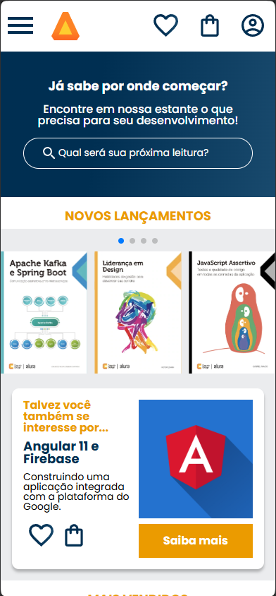
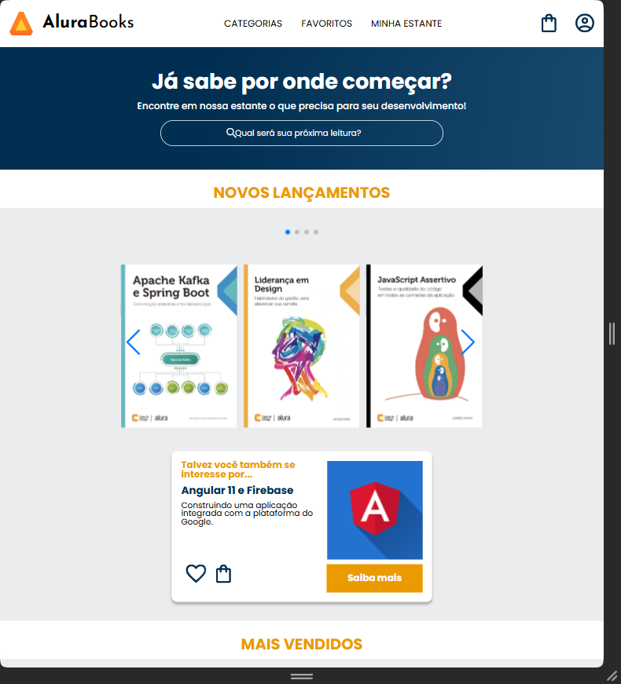
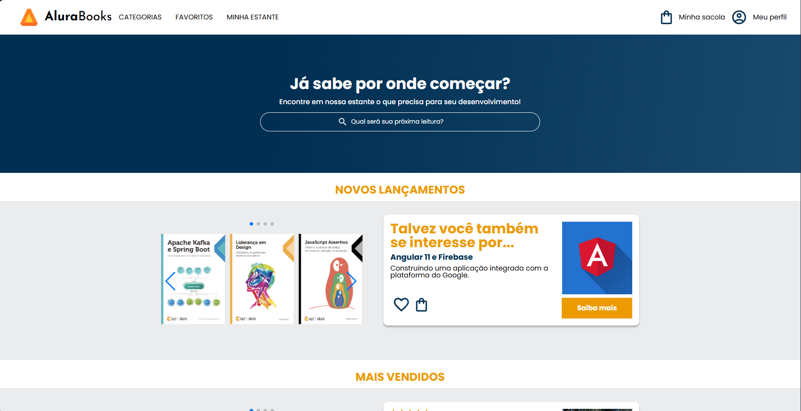

Alurabooks
Este projeto, desenvolvido durante o curso de responsividade da Alura, demonstra a criação de um layout web totalmente responsivo utilizando HTML e CSS. Ele se adapta perfeitamente a diferentes tamanhos de tela, priorizando a experiência mobile-first.

🚀 Funcionalidades
Design Responsivo: Layout adaptável a qualquer dispositivo (mobile, tablet, desktop) com a abordagem mobile-first.
HTML Semântico: Estrutura clara e acessível para SEO e melhor compreensão do conteúdo.
Estilização Profissional: Uso de CSS com técnicas avançadas como Media Queries para responsividade.
Código Limpo: Bem organizado e comentado para facilitar a manutenção e futuras expansões.

💻 Como Usar
Para visualizar o projeto, siga estes passos simples:

Clone o repositório:
Bash

git clone https://github.com/seu-usuario/alurabooks.git
Abra no navegador: Navegue até a pasta alurabooks e abra o arquivo index.html em seu navegador de preferência.

🛠️ Tecnologias
HTML5: Linguagem de marcação para a estrutura do conteúdo.
CSS3: Linguagem de estilo para o design e a responsividade.

🙏 Créditos
Este projeto foi inspirado e guiado pelo excelente curso de responsividade da Alura, ministrado pela instrutora Mônica Mazzochi Hillman.

✨ Galeria de Imagens
Confira o visual do projeto Alurabooks em ação. As imagens abaixo ilustram a adaptação do layout em diversos tamanhos de tela:

Curso de Responsividade da Alura
📝 Licença
Este projeto está sob a licença MIT. Para mais detalhes, consulte o arquivo LICENSE.

